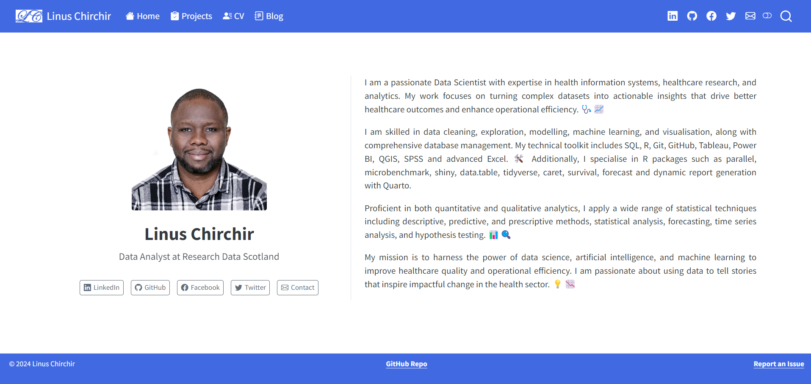

# Welcome to the Repo of Linus Chirchir's Quarto Website

This repository contains the source code and configuration for Linus Chirchir's Quarto website, hosted at [linuschirchir.quarto.pub](https://linuschirchir.quarto.pub).



## Table of Contents

- [Introduction](#introduction)
- [Prerequisites](#prerequisites)
- [Installation](#installation)
- [Site Structure](#site-structure)
- [Customisation](#customisation)
- [License](#license)

## Introduction

This project is the foundation of my personal Quarto website, where I share content related to data science, artificial intelligence, machine learning, and health information systems. The website includes blog posts, my CV, and details on various projects I've worked on.

## Prerequisites

Before getting started, ensure you have the following installed on your machine:

- **Quarto**: The website is built using the Quarto framework. You can download it from the [official site](https://quarto.org/).
- **Git**: To fork and clone this repository.
- **Web Browser**: To view the rendered site locally.

## Installation

To install and run the project locally, follow these steps:

1. Fork the repository:
   - Go to the repository page on GitHub: https://github.com/linuschirchir/linuschirchir.quarto.pub
   - Click the "Fork" button in the top-right corner of the page to create a copy of the repository under your GitHub account.

2. Clone your forked repository to your local machine:
   ```bash
   git clone https://github.com/<your-username>/linuschirchir.quarto.pub.git
   cd linuschirchir.quarto.pub
   ```

3. Install Quarto on your system following the instructions from the [Quarto website](https://quarto.org/docs/get-started/).

4. Render the site locally:
   ```bash
   quarto render
   ```

5. Open the generated `_site/index.html` file in your web browser to view the site locally.

## Site Structure

The main files and directories of interest in this project are:

- **_quarto.yml**: The central configuration file for the site. It includes metadata, navigation, and layout options.
- **about.qmd**: The "About Me" page written in Quarto markdown.
- **blog.qmd**: The section where blog posts are rendered.
- **cv.qmd**: Contains the content for my professional CV.
- **projects.qmd**: Showcases various projects I've worked on.
- **styles.css**: Custom styles applied to the site.
- **dark.scss & light.scss**: SCSS files to manage different themes for the site.

## Customisation

Feel free to customise the site to your needs by adjusting the following:

- **Themes**: Modify the `styles.css` or use the SCSS files to tweak light and dark themes.
- **Content**: Update the Quarto markdown files (`.qmd`) to add new blog posts, projects, or modify existing content.
- **Metadata**: Customise the `_quarto.yml` file to change the site’s metadata, such as title, description, and navigation layout.

## License

This project is licensed under the MIT License. Feel free to use, modify, and distribute it as long as attribution is provided. See the `LICENSE` file for more details.

---

Happy browsing!  
**Linus Chirchir**  
[Visit My Website](https://linuschirchir.quarto.pub)
